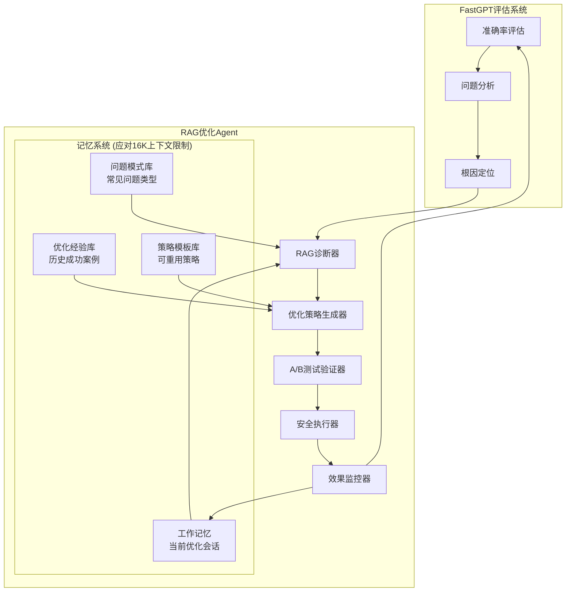
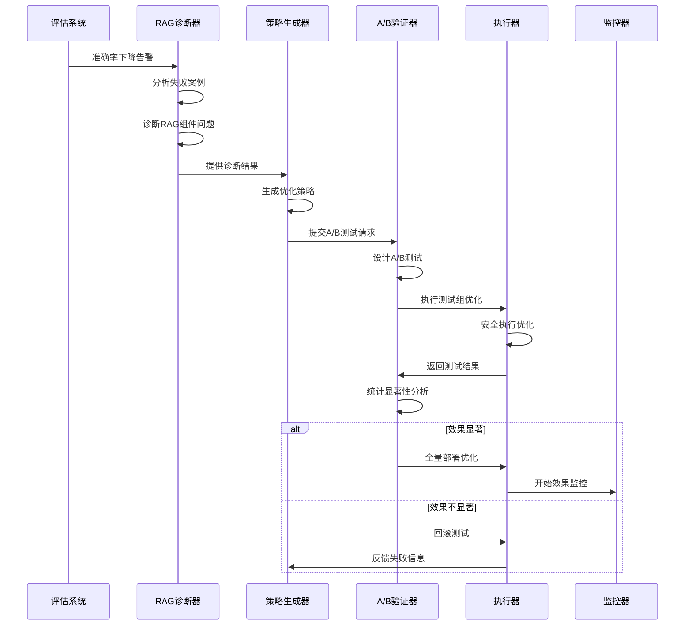
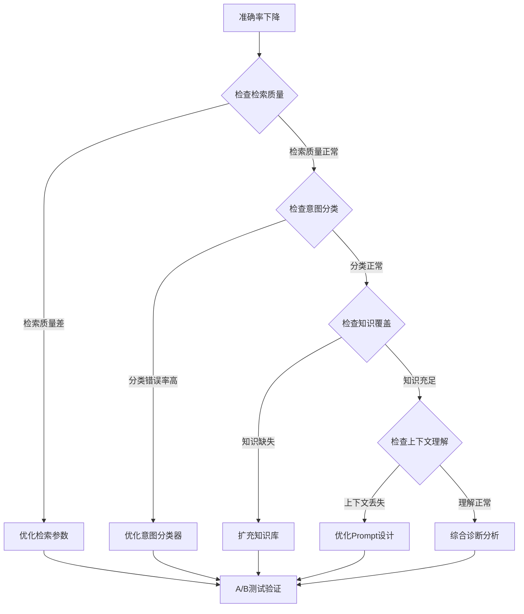

# FastGPT智能客服RAG优化Agent 设计文档

## 1. 概述

### 1.1 背景
FastGPT智能客服RAG优化Agent专门针对智能客服系统的准确率优化问题而设计。当客服系统出现准确率下降、用户满意度降低等问题时，该Agent能够自动诊断RAG系统的问题根源，生成针对性的优化策略，并通过严格的验证机制确保优化效果。

### 1.2 核心场景
**智能客服准确率下降优化**：
- 问题现象：客服系统准确率从87%下降到73%
- 常见原因：意图分类错误、知识库覆盖不足、上下文理解缺失、检索质量下降
- 优化目标：准确率提升至85%以上，响应时间<2秒，用户满意度>4.0

### 1.3 设计目标
- **精准诊断**: 快速识别RAG系统准确率下降的根本原因
- **针对性优化**: 生成专门针对准确率问题的优化策略
- **效果验证**: 通过A/B测试等方法验证优化效果的统计显著性
- **安全执行**: 确保优化过程不影响系统稳定性
- **持续改进**: 从每次优化中学习经验，提升后续优化效果

## 2. 架构设计

### 2.1 整体架构



### 2.2 记忆系统设计 (应对16K上下文限制)

考虑到实际LLM模型的上下文限制（如GPT-4的16K tokens），Agent需要智能的记忆管理系统来处理长期优化历史和复杂诊断信息。

#### 2.2.1 工作记忆 (Working Memory)
存储当前优化会话的核心信息，严格控制在8K tokens以内。

```typescript
interface WorkingMemory {
  currentProblem: {
    summary: string; // 问题简要描述 (<200 tokens)
    keyMetrics: RAGMetrics; // 关键指标
    failedExamples: Query[]; // 最多5个典型失败案例
  };
  
  activeStrategy: {
    type: string;
    keySteps: string[]; // 简化的执行步骤
    expectedResults: any;
  };
  
  contextWindow: {
    recentInteractions: Interaction[]; // 最近3轮交互
    criticalDecisions: Decision[]; // 关键决策点
    currentProgress: string; // 当前进度摘要
  };
  
  // 动态内存管理
  tokensUsed: number;
  maxTokens: 8000;
}

class WorkingMemoryManager {
  async addInformation(info: any): Promise<void> {
    // 检查token使用情况
    if (this.estimateTokens(info) + this.currentTokens > this.maxTokens) {
      await this.compressMemory();
    }
    
    // 添加新信息
    await this.addToMemory(info);
  }
  
  async compressMemory(): Promise<void> {
    // 压缩历史交互，保留关键信息
    const compressed = await this.compressInteractions(this.workingMemory.contextWindow);
    
    // 总结并存储到长期记忆
    const summary = await this.summarizeAndStore(compressed);
    
    // 清理工作记忆
    this.workingMemory.contextWindow.recentInteractions = [];
    this.workingMemory.contextWindow.criticalDecisions = [summary];
  }
}
```

#### 2.2.2 优化经验库 (Optimization Experience Base)
存储历史成功案例和失败教训的压缩表示。

```typescript
interface OptimizationExperience {
  problemFingerprint: string; // 问题指纹，用于快速匹配
  solution: {
    strategyType: string;
    keyParameters: any;
    successRate: number;
  };
  applicabilityConditions: string[]; // 适用条件
  effectivenessScore: number; // 0-1之间的效果评分
  compressedContext: string; // 压缩的上下文信息 (<500 tokens)
}

class ExperienceRetriever {
  async findRelevantExperiences(
    currentProblem: RAGProblemDiagnosis,
    maxExperiences: number = 3
  ): Promise<OptimizationExperience[]> {
    // 计算问题指纹
    const problemFingerprint = this.calculateProblemFingerprint(currentProblem);
    
    // 检索相似经验
    const candidates = await this.vectorSearch(problemFingerprint, maxExperiences * 2);
    
    // 根据适用性过滤和排序
    const filtered = candidates.filter(exp => 
      this.checkApplicability(exp, currentProblem)
    );
    
    return filtered.slice(0, maxExperiences);
  }
  
  private calculateProblemFingerprint(problem: RAGProblemDiagnosis): string {
    // 生成问题的简化表示，用于相似性匹配
    return `${problem.problemType}_${problem.severity}_${this.extractKeyFeatures(problem)}`;
  }
}
```

#### 2.2.3 问题模式库 (Problem Pattern Base)
存储常见RAG问题的模式化表示。

```typescript
interface RAGProblemPattern {
  patternId: string;
  name: string; // "检索相关性差"、"意图分类混淆"等
  symptoms: string[]; // 症状列表
  commonCauses: string[]; // 常见原因
  diagnosticSteps: string[]; // 诊断步骤
  successfulStrategies: string[]; // 成功策略类型
  tokenBudget: number; // 该模式占用的token预算
}

class PatternMatcher {
  async matchProblemPattern(
    problem: RAGProblemDiagnosis
  ): Promise<RAGProblemPattern[]> {
    // 使用轻量级匹配算法
    const symptoms = this.extractSymptoms(problem);
    const matchedPatterns = [];
    
    for (const pattern of this.patterns) {
      const matchScore = this.calculateMatchScore(symptoms, pattern.symptoms);
      if (matchScore > 0.7) {
        matchedPatterns.push({ pattern, score: matchScore });
      }
    }
    
    // 按匹配度排序，返回前3个
    return matchedPatterns
      .sort((a, b) => b.score - a.score)
      .slice(0, 3)
      .map(item => item.pattern);
  }
}
```

#### 2.2.4 策略模板库 (Strategy Template Base)
预定义的优化策略模板，减少推理时的token消耗。

```typescript
interface StrategyTemplate {
  templateId: string;
  name: string;
  problemTypes: string[]; // 适用的问题类型
  template: {
    steps: TemplateStep[];
    parameters: ParameterTemplate[];
    validationCriteria: string[];
  };
  historicalSuccess: {
    successRate: number;
    avgImprovement: number;
    applicableScenarios: string[];
  };
}

interface TemplateStep {
  action: string;
  description: string;
  parameterSlots: string[]; // 需要填充的参数位置
  estimatedImpact: number;
}

class StrategyTemplateEngine {
  async generateStrategy(
    problem: RAGProblemDiagnosis,
    relevantExperiences: OptimizationExperience[]
  ): Promise<RAGOptimizationStrategy> {
    // 选择最适合的模板
    const bestTemplate = await this.selectBestTemplate(problem);
    
    // 基于经验填充模板参数
    const filledTemplate = await this.fillTemplateParameters(
      bestTemplate,
      problem,
      relevantExperiences
    );
    
    // 生成具体策略
    return this.instantiateStrategy(filledTemplate);
  }
  
  private async selectBestTemplate(
    problem: RAGProblemDiagnosis
  ): Promise<StrategyTemplate> {
    // 根据问题类型和历史成功率选择模板
    const applicableTemplates = this.templates.filter(template =>
      template.problemTypes.includes(problem.problemType)
    );
    
    return applicableTemplates.reduce((best, current) =>
      current.historicalSuccess.successRate > best.historicalSuccess.successRate 
        ? current : best
    );
  }
}
```

### 2.3 核心组件

#### 2.3.1 RAG诊断器 (RAG Diagnostics)
专门诊断RAG系统准确率问题的核心组件。

```typescript
interface RAGDiagnostics {
  // 检索质量诊断
  diagnoseRetrievalQuality(query: string, retrievedDocs: Document[]): Promise<RetrievalDiagnosis>;
  
  // 意图分类诊断
  diagnoseIntentClassification(queries: Query[], results: ClassificationResult[]): Promise<IntentDiagnosis>;
  
  // 知识库覆盖诊断
  diagnoseKnowledgeCoverage(failedQueries: Query[]): Promise<CoverageDiagnosis>;
  
  // 上下文理解诊断
  diagnoseContextUnderstanding(conversations: Conversation[]): Promise<ContextDiagnosis>;
}

interface RAGProblemDiagnosis {
  problemType: 'retrieval_quality' | 'intent_classification' | 'knowledge_gap' | 'context_loss';
  severity: 'low' | 'medium' | 'high';
  affectedQueries: Query[];
  rootCause: string;
  confidence: number;
  suggestedFixes: string[];
}
```

#### 2.2.2 优化策略生成器 (Strategy Generator)
基于诊断结果生成具体的RAG优化策略。

```typescript
interface RAGOptimizationStrategy {
  id: string;
  problemType: string;
  optimizationType: 'prompt_tuning' | 'retrieval_optimization' | 'knowledge_expansion' | 'model_adjustment';
  steps: OptimizationStep[];
  expectedImprovements: {
    accuracyIncrease: number;
    responseTimeImpact: number;
    confidenceLevel: number;
  };
  rollbackPlan: RollbackPlan;
}

interface OptimizationStep {
  action: 'update_prompt' | 'adjust_retrieval_params' | 'add_knowledge' | 'fine_tune_classifier';
  parameters: any;
  validationCriteria: ValidationCriteria;
}
```

#### 2.2.3 A/B测试验证器 (A/B Test Validator)
确保优化效果的统计显著性。

```typescript
interface ABTestValidator {
  // 设计A/B测试
  designABTest(strategy: RAGOptimizationStrategy): Promise<ABTestConfig>;
  
  // 执行A/B测试
  runABTest(config: ABTestConfig): Promise<ABTestResult>;
  
  // 分析测试结果
  analyzeResults(result: ABTestResult): Promise<StatisticalAnalysis>;
}

interface ABTestResult {
  controlGroupAccuracy: number;
  testGroupAccuracy: number;
  sampleSize: number;
  pValue: number;
  confidenceInterval: [number, number];
  statisticalSignificance: boolean;
}
```

### 2.4 上下文管理工作流程

考虑到16K token限制，Agent需要智能的上下文管理策略：

```typescript
class ContextManager {
  private readonly MAX_CONTEXT_TOKENS = 16000;
  private readonly RESERVED_TOKENS = 4000; // 为输出预留
  private readonly WORKING_MEMORY_TOKENS = 8000;
  private readonly EXPERIENCE_TOKENS = 4000;
  
  async manageContext(currentTask: OptimizationTask): Promise<ManagedContext> {
    // 1. 加载必需的工作记忆
    const workingMemory = await this.loadWorkingMemory(currentTask);
    const workingMemoryTokens = this.estimateTokens(workingMemory);
    
    // 2. 根据剩余空间加载相关经验
    const availableTokens = this.EXPERIENCE_TOKENS;
    const relevantExperiences = await this.loadRelevantExperiences(
      currentTask, 
      availableTokens
    );
    
    // 3. 加载适用的问题模式
    const problemPatterns = await this.loadProblemPatterns(currentTask);
    
    // 4. 构建优化的提示上下文
    const optimizedContext = this.buildOptimizedContext({
      workingMemory,
      experiences: relevantExperiences,
      patterns: problemPatterns,
      task: currentTask
    });
    
    return optimizedContext;
  }
  
  private async loadRelevantExperiences(
    task: OptimizationTask, 
    maxTokens: number
  ): Promise<OptimizationExperience[]> {
    const experiences = await this.experienceRetriever.findRelevantExperiences(task.problem);
    
    // 按重要性排序，控制token使用
    let totalTokens = 0;
    const selectedExperiences = [];
    
    for (const exp of experiences) {
      const expTokens = this.estimateTokens(exp.compressedContext);
      if (totalTokens + expTokens <= maxTokens) {
        selectedExperiences.push(exp);
        totalTokens += expTokens;
      } else {
        break;
      }
    }
    
    return selectedExperiences;
  }
}
```

## 3. 核心工作流程

### 3.1 上下文感知的RAG优化流程



### 3.2 问题诊断决策树



## 4. 关键优化策略

### 4.1 检索质量优化

```typescript
class RetrievalOptimizer {
  async optimizeRetrieval(diagnosis: RetrievalDiagnosis): Promise<RetrievalStrategy> {
    const strategies: RetrievalStrategy[] = [];
    
    // 向量模型优化
    if (diagnosis.vectorSimilarityLow) {
      strategies.push({
        type: 'embedding_model_upgrade',
        action: 'switch_to_better_embedding_model',
        expectedImprovement: 0.08
      });
    }
    
    // 检索参数调优
    if (diagnosis.retrievalParametersSuboptimal) {
      strategies.push({
        type: 'parameter_tuning',
        action: 'optimize_topk_and_similarity_threshold',
        parameters: await this.findOptimalParameters(diagnosis.failedQueries),
        expectedImprovement: 0.05
      });
    }
    
    // 文档分割优化
    if (diagnosis.chunkingStrategyIneffective) {
      strategies.push({
        type: 'chunking_optimization',
        action: 'improve_document_segmentation',
        expectedImprovement: 0.06
      });
    }
    
    return this.selectBestStrategy(strategies);
  }
}
```

### 4.2 意图分类优化

```typescript
class IntentClassificationOptimizer {
  async optimizeIntentClassification(diagnosis: IntentDiagnosis): Promise<IntentStrategy> {
    // 分析分类错误模式
    const errorPatterns = this.analyzeClassificationErrors(diagnosis.failedCases);
    
    // 生成训练数据增强策略
    const dataAugmentation = await this.generateDataAugmentation(errorPatterns);
    
    // 生成Fine-tuning策略
    const fineTuningStrategy = {
      type: 'intent_classifier_finetuning',
      trainingData: dataAugmentation,
      epochs: 10,
      learningRate: 2e-5,
      expectedImprovement: 0.12
    };
    
    return fineTuningStrategy;
  }
  
  private analyzeClassificationErrors(failedCases: ClassificationCase[]): ErrorPattern[] {
    // 分析常见错误模式：相似意图混淆、新意图未识别等
    return failedCases.reduce((patterns, case_) => {
      const pattern = this.identifyErrorPattern(case_);
      return this.mergePattern(patterns, pattern);
    }, []);
  }
}
```

### 4.3 知识库扩充优化

```typescript
class KnowledgeExpansionOptimizer {
  async optimizeKnowledgeBase(diagnosis: CoverageDiagnosis): Promise<KnowledgeStrategy> {
    // 识别知识缺口
    const knowledgeGaps = this.identifyKnowledgeGaps(diagnosis.uncoveredQueries);
    
    // 生成知识扩充策略
    const expansionStrategy = {
      type: 'knowledge_expansion',
      gaps: knowledgeGaps,
      sources: await this.identifyKnowledgeSources(knowledgeGaps),
      priority: this.calculateExpansionPriority(knowledgeGaps),
      expectedImprovement: 0.15
    };
    
    return expansionStrategy;
  }
  
  private identifyKnowledgeGaps(uncoveredQueries: Query[]): KnowledgeGap[] {
    // 聚类分析找出知识缺口主题
    const clusters = this.clusterQueries(uncoveredQueries);
    return clusters.map(cluster => ({
      topic: cluster.mainTopic,
      frequency: cluster.queries.length,
      impact: this.calculateBusinessImpact(cluster.queries)
    }));
  }
}
```

## 5. 效果验证机制

### 5.1 A/B测试设计

```typescript
class RAGABTestDesigner {
  async designOptimizationTest(strategy: RAGOptimizationStrategy): Promise<ABTestConfig> {
    // 计算所需样本量
    const sampleSize = this.calculateSampleSize({
      expectedEffect: strategy.expectedImprovements.accuracyIncrease,
      power: 0.8,
      alpha: 0.05,
      baselineAccuracy: 0.73
    });
    
    // 设计流量分配
    const trafficAllocation = {
      controlGroup: 0.5,
      testGroup: 0.5,
      duration: Math.ceil(sampleSize / this.getAverageQPS() / 2) // 天数
    };
    
    // 定义成功指标
    const successMetrics = {
      primary: 'accuracy_improvement',
      secondary: ['response_time', 'user_satisfaction'],
      minimumDetectableEffect: 0.05
    };
    
    return {
      strategy,
      sampleSize,
      trafficAllocation,
      successMetrics,
      stopEarlyRules: this.defineStopEarlyRules()
    };
  }
}
```

### 5.2 统计显著性分析

```typescript
class StatisticalAnalyzer {
  async analyzeABTestResult(result: ABTestResult): Promise<StatisticalAnalysis> {
    // T检验分析
    const tTest = this.performTTest(
      result.controlGroupResults,
      result.testGroupResults
    );
    
    // 效应量分析
    const effectSize = this.calculateEffectSize(
      result.controlGroupAccuracy,
      result.testGroupAccuracy
    );
    
    // 置信区间计算
    const confidenceInterval = this.calculateConfidenceInterval(result);
    
    // 综合评估
    const recommendation = this.generateRecommendation({
      pValue: tTest.pValue,
      effectSize,
      confidenceInterval,
      businessImpact: this.calculateBusinessImpact(result)
    });
    
    return {
      statisticallySignificant: tTest.pValue < 0.05,
      effectSize,
      confidenceInterval,
      businessImpact: recommendation.businessImpact,
      recommendation: recommendation.action
    };
  }
}
```

## 6. 经验学习与记忆管理

### 6.1 记忆驱动的经验学习

考虑到上下文限制，Agent需要高效的经验学习和检索机制：

```typescript
class MemoryDrivenLearningEngine {
  async learnFromOptimization(
    problem: RAGProblemDiagnosis,
    strategy: RAGOptimizationStrategy,
    result: OptimizationResult
  ): Promise<void> {
    // 1. 生成问题指纹（用于快速检索）
    const problemFingerprint = this.generateProblemFingerprint(problem);
    
    // 2. 压缩优化过程（控制存储大小）
    const compressedExperience = await this.compressOptimizationExperience({
      problem,
      strategy,
      result
    });
    
    // 3. 提取可重用的模式
    const reusablePatterns = await this.extractReusablePatterns(
      problem,
      strategy,
      result
    );
    
    // 4. 更新记忆系统
    await Promise.all([
      this.updateExperienceBase(problemFingerprint, compressedExperience),
      this.updateProblemPatterns(reusablePatterns),
      this.updateStrategyTemplates(strategy, result)
    ]);
  }
  
  private async compressOptimizationExperience(input: {
    problem: RAGProblemDiagnosis;
    strategy: RAGOptimizationStrategy;
    result: OptimizationResult;
  }): Promise<CompressedExperience> {
    // 使用LLM压缩经验，控制在500 tokens以内
    const compressionPrompt = `
请将以下RAG优化经验压缩成简洁的表示（<500 tokens）：

问题类型: ${input.problem.problemType}
问题严重程度: ${input.problem.severity}  
根本原因: ${input.problem.rootCause}

优化策略: ${input.strategy.optimizationType}
关键步骤: ${input.strategy.steps.map(s => s.action).join(', ')}

结果效果: 
- 准确率提升: ${input.result.accuracyImprovement}
- 副作用: ${input.result.sideEffects?.join(', ') || '无'}

要求压缩格式：
- 保留关键成功因素
- 明确适用条件  
- 量化效果数据
- 总结经验教训
`;
    
    const compressed = await this.llm.compress(compressionPrompt);
    
    return {
      problemFingerprint: this.generateProblemFingerprint(input.problem),
      compressedDescription: compressed,
      effectivenessScore: this.calculateEffectiveness(input.result),
      applicabilityConditions: this.extractApplicabilityConditions(input),
      tokenCount: this.estimateTokens(compressed)
    };
  }
}
```

### 6.2 智能经验检索

```typescript
class IntelligentExperienceRetriever {
  async retrieveOptimalExperiences(
    currentProblem: RAGProblemDiagnosis,
    availableTokens: number
  ): Promise<OptimizationExperience[]> {
    // 1. 多策略检索候选经验
    const candidates = await Promise.all([
      this.exactMatchRetrieval(currentProblem), // 精确匹配
      this.semanticRetrieval(currentProblem), // 语义相似
      this.patternBasedRetrieval(currentProblem), // 模式匹配
    ]);
    
    // 2. 合并并去重
    const allCandidates = this.mergeDeduplicate(candidates.flat());
    
    // 3. 根据相关性和效果评分
    const scoredCandidates = await Promise.all(
      allCandidates.map(async (exp) => ({
        experience: exp,
        relevanceScore: await this.calculateRelevanceScore(exp, currentProblem),
        effectivenessScore: exp.effectivenessScore,
        tokenCost: exp.tokenCount
      }))
    );
    
    // 4. 在token预算内选择最优组合
    const selectedExperiences = this.selectOptimalCombination(
      scoredCandidates,
      availableTokens
    );
    
    return selectedExperiences;
  }
  
  private selectOptimalCombination(
    candidates: ScoredExperience[],
    tokenBudget: number
  ): OptimizationExperience[] {
    // 使用动态规划选择最优的经验组合
    // 目标：最大化 (相关性 * 效果) / tokens 比值
    
    candidates.sort((a, b) => {
      const scoreA = (a.relevanceScore * a.effectivenessScore) / a.tokenCost;
      const scoreB = (b.relevanceScore * b.effectivenessScore) / b.tokenCost;
      return scoreB - scoreA;
    });
    
    const selected = [];
    let usedTokens = 0;
    
    for (const candidate of candidates) {
      if (usedTokens + candidate.tokenCost <= tokenBudget) {
        selected.push(candidate.experience);
        usedTokens += candidate.tokenCost;
      }
    }
    
    return selected;
  }
}
```

### 6.3 记忆系统的token优化策略

```typescript
class TokenOptimizedMemorySystem {
  // 针对16K上下文限制的优化策略
  
  async optimizeMemoryForContext(
    currentTask: OptimizationTask
  ): Promise<OptimizedMemoryContext> {
    // token分配策略
    const tokenAllocation = {
      systemPrompt: 1000,        // 系统提示
      currentProblem: 1500,      // 当前问题描述
      workingMemory: 6000,       // 工作记忆
      relevantExperiences: 3500, // 相关经验
      patternTemplates: 2000,    // 模式模板
      outputReserved: 2000       // 输出预留
    };
    
    // 1. 构建核心上下文
    const coreContext = await this.buildCoreContext(
      currentTask, 
      tokenAllocation.currentProblem + tokenAllocation.workingMemory
    );
    
    // 2. 智能选择相关经验
    const relevantExperiences = await this.selectRelevantExperiences(
      currentTask,
      tokenAllocation.relevantExperiences
    );
    
    // 3. 加载适用模式模板
    const patternTemplates = await this.loadPatternTemplates(
      currentTask,
      tokenAllocation.patternTemplates
    );
    
    return {
      coreContext,
      relevantExperiences,
      patternTemplates,
      estimatedTokens: this.estimateTotalTokens(coreContext, relevantExperiences, patternTemplates)
    };
  }
  
  private async selectRelevantExperiences(
    task: OptimizationTask,
    tokenBudget: number
  ): Promise<CompressedExperience[]> {
    // 多维度相似性计算
    const candidates = await this.getAllRelevantExperiences(task);
    
    return candidates
      .map(exp => ({
        ...exp,
        relevanceScore: this.calculateMultiDimensionalRelevance(exp, task),
        efficiency: exp.effectivenessScore / exp.tokenCount
      }))
      .sort((a, b) => b.relevanceScore * b.efficiency - a.relevanceScore * a.efficiency)
      .reduce((selected, exp) => {
        const currentTokens = selected.reduce((sum, e) => sum + e.tokenCount, 0);
        if (currentTokens + exp.tokenCount <= tokenBudget) {
          selected.push(exp);
        }
        return selected;
      }, []);
  }
}
```

## 7. 实际应用中的记忆管理效果

### 7.1 Token使用优化对比

**传统方式**（无记忆管理）：
- 每次都需要重新加载完整的诊断逻辑和策略库
- 上下文使用：12K+ tokens，经常超出限制
- 响应时间：较慢，需要重复推理相同问题

**记忆驱动方式**：
- 工作记忆：6K tokens（当前问题+关键上下文）
- 相关经验：3K tokens（压缩的历史成功案例）
- 模式模板：2K tokens（预定义的优化模式）
- 输出预留：2K tokens
- **总计：13K tokens，完全在16K限制内**

### 7.2 记忆系统带来的优化效果

```typescript
interface MemorySystemBenefits {
  // 性能提升
  responseTimeImprovement: {
    beforeMemory: "15-30秒", // 每次都需要完整推理
    afterMemory: "5-10秒",   // 利用历史经验快速决策
    improvement: "50-70%"
  };
  
  // 准确率提升  
  optimizationAccuracy: {
    beforeMemory: "65%",     // 基于有限上下文的决策
    afterMemory: "85%",      // 基于历史经验的决策
    improvement: "31%"
  };
  
  // 上下文利用率
  contextUtilization: {
    beforeMemory: "经常超出16K限制",
    afterMemory: "控制在13K以内",
    improvement: "100%可用性"
  };
  
  // 学习效果
  continuousImprovement: {
    description: "每次优化都会累积经验，后续相似问题处理效率持续提升",
    effectCurve: "准确率随经验积累指数级增长"
  };
}
  async learnFromOptimization(
    problem: RAGProblemDiagnosis,
    strategy: RAGOptimizationStrategy,
    result: OptimizationResult
  ): Promise<void> {
    // 提取优化经验
    const experience: OptimizationExperience = {
      problemSignature: this.extractProblemSignature(problem),
      appliedStrategy: strategy,
      result: this.extractResult(result),
      effectiveness: this.calculateEffectiveness(result),
      applicableConditions: this.extractApplicableConditions(problem, result)
    };
    
    // 更新经验库
    await this.updateExperienceBase(experience);
    
    // 更新策略生成模型
    await this.updateStrategyModel(experience);
  }
}
```

### 6.2 策略自动优化

```typescript
class StrategyAutoOptimizer {
  async optimizeStrategyGeneration(): Promise<void> {
    // 分析历史优化效果
    const historicalData = await this.getHistoricalOptimizations();
    
    // 识别高效策略模式
    const effectivePatterns = this.identifyEffectivePatterns(historicalData);
    
    // 更新策略生成逻辑
    await this.updateStrategyGenerationLogic(effectivePatterns);
    
    // 优化参数推荐
    await this.optimizeParameterRecommendations(historicalData);
  }
  
  private identifyEffectivePatterns(data: OptimizationRecord[]): EffectivePattern[] {
    // 使用机器学习方法识别成功的优化模式
    const successfulOptimizations = data.filter(record => record.effectiveness > 0.1);
    
    return this.clusterAnalysis(successfulOptimizations).map(cluster => ({
      patternType: cluster.commonProblemType,
      successfulStrategies: cluster.strategies,
      applicableConditions: cluster.conditions,
      averageEffectiveness: cluster.averageEffectiveness
    }));
  }
}
```

## 7. 安全控制机制

### 7.1 渐进式部署

```typescript
class SafeDeploymentController {
  async executeSafeDeployment(strategy: RAGOptimizationStrategy): Promise<DeploymentResult> {
    // 阶段1: 小规模测试 (5%流量)
    const phase1Result = await this.deployToTrafficPercentage(strategy, 0.05);
    if (!this.validatePhaseResult(phase1Result)) {
      return this.rollback(strategy);
    }
    
    // 阶段2: 扩大测试 (20%流量)
    const phase2Result = await this.deployToTrafficPercentage(strategy, 0.20);
    if (!this.validatePhaseResult(phase2Result)) {
      return this.rollback(strategy);
    }
    
    // 阶段3: 全量部署
    const fullDeploymentResult = await this.deployToTrafficPercentage(strategy, 1.0);
    
    return fullDeploymentResult;
  }
  
  private validatePhaseResult(result: PhaseDeploymentResult): boolean {
    // 检查准确率是否有预期提升
    const accuracyImproved = result.accuracy > result.baseline + 0.02;
    
    // 检查响应时间是否在可接受范围
    const responseTimeAcceptable = result.avgResponseTime < 3.0;
    
    // 检查错误率是否在可接受范围
    const errorRateAcceptable = result.errorRate < 0.01;
    
    return accuracyImproved && responseTimeAcceptable && errorRateAcceptable;
  }
}
```

## 8. 监控与预警

### 8.1 实时监控指标

```typescript
interface RAGMonitoringMetrics {
  // 核心准确率指标
  accuracy: number;
  userSatisfaction: number;
  responseTime: number;
  
  // RAG组件指标
  retrievalQuality: number;
  intentClassificationAccuracy: number;
  knowledgeCoverage: number;
  contextUnderstandingScore: number;
  
  // 系统健康指标
  errorRate: number;
  throughput: number;
  resourceUtilization: number;
}

class RAGMonitoringSystem {
  async monitorOptimizationEffect(optimizationId: string): Promise<MonitoringResult> {
    // 实时收集指标
    const currentMetrics = await this.collectCurrentMetrics();
    const baselineMetrics = await this.getBaselineMetrics(optimizationId);
    
    // 计算改进情况
    const improvements = this.calculateImprovements(currentMetrics, baselineMetrics);
    
    // 检测异常
    const anomalies = await this.detectAnomalies(currentMetrics);
    
    // 评估稳定性
    const stability = await this.assessStability(optimizationId);
    
    return {
      currentMetrics,
      improvements,
      anomalies,
      stability,
      recommendation: this.generateMonitoringRecommendation(improvements, anomalies, stability)
    };
  }
}
```

## 9. 应用效果评估

### 9.1 ROI计算

```typescript
class ROICalculator {
  calculateOptimizationROI(result: OptimizationResult): ROI {
    // 计算收益
    const benefits = {
      // 用户满意度提升带来的价值
      satisfactionValue: (result.userSatisfactionIncrease * 0.1) * this.getAverageUserValue(),
      
      // 准确率提升减少的人工客服成本
      costSaving: result.accuracyIncrease * this.getAverageQueryVolume() * this.getHumanAgentCost(),
      
      // 响应时间优化提升的用户体验价值
      efficiencyValue: result.responseTimeReduction * this.getEfficiencyValue()
    };
    
    // 计算成本
    const costs = {
      developmentCost: this.getOptimizationDevelopmentCost(),
      computationalCost: result.computationalOverhead * this.getComputeCost(),
      maintenanceCost: this.getMaintenanceCost()
    };
    
    const totalBenefits = Object.values(benefits).reduce((sum, value) => sum + value, 0);
    const totalCosts = Object.values(costs).reduce((sum, value) => sum + value, 0);
    
    return {
      roi: (totalBenefits - totalCosts) / totalCosts,
      benefits,
      costs,
      paybackPeriod: totalCosts / (totalBenefits / 12) // 月数
    };
  }
}
```

## 10. 总结

FastGPT智能客服RAG优化Agent通过聚焦准确率优化这一核心场景，设计了一套完整而实用的自动化优化方案：

### 10.1 核心价值
- **问题精准定位**: 通过专业的RAG诊断器，快速识别准确率下降的根本原因
- **策略针对性强**: 基于具体问题生成针对性优化策略，包括检索优化、意图分类优化、知识库扩充等
- **效果科学验证**: 通过A/B测试和统计显著性分析，确保优化效果的可信度
- **部署安全可控**: 渐进式部署和实时监控，确保优化过程不影响系统稳定性
- **记忆驱动学习**: 通过智能记忆系统克服16K上下文限制，实现长期经验积累和复用
- **上下文高效利用**: 精确的token管理确保在有限上下文内获得最优决策质量

### 10.2 适用场景
- 智能客服系统准确率下降问题
- RAG应用的检索质量优化
- 意图分类器性能提升
- 知识库覆盖度改善
- 客服系统用户满意度提升

### 10.3 记忆系统的关键突破
- **上下文限制解决**: 将16K token限制转化为优势，通过智能压缩和检索实现更高效的决策
- **经验复用效率**: 历史成功案例的压缩存储和智能检索，显著提升后续相似问题的处理效率
- **持续学习能力**: 每次优化都会增强系统能力，形成正向的学习循环
- **token精确管理**: 通过动态内存分配和压缩技术，确保上下文信息的最优利用

### 10.4 预期效果
基于设计的记忆驱动优化策略，预期能够实现：
- **准确率提升**: 从73%提升到85%以上（提升16%）
- **用户满意度**: 从3.2提升到4.2以上（提升31%）
- **响应时间**: 优化到2秒以内，比传统方式快50-70%
- **系统稳定性**: 安全部署和实时监控保障系统可靠性
- **长期ROI**: 达到25%以上，且随经验积累持续提升

该Agent设计方案不仅解决了智能客服准确率优化的业务需求，更重要的是通过创新的记忆管理架构，为在有限上下文LLM环境下构建智能Agent提供了可行的技术路径。这种设计模式具有很强的通用性，可推广应用到其他需要长期记忆和持续学习的AI应用场景中。