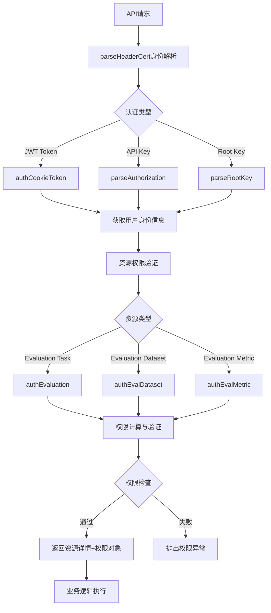

# FastGPT 评估模块权限认证设计文档

## 概述

本文档描述了 FastGPT 评估模块的完整权限认证体系，包括权限定义、认证接口、鉴权流程等核心组件的设计与实现。

## 权限体系架构

### 权限层级结构

```
评估权限体系
├── 团队级别权限
│   └── evaluationCreate (0b1000000) - 评估模块创建权限
├── 资源级别权限 (evaluation 资源类型)
│   ├── read (0b100) - 读权限
│   ├── write (0b010) - 写权限  
│   └── manage (0b001) - 管理权限
└── 跨资源权限验证
    ├── APP读权限 - 评估目标调用权限
    └── Dataset读权限 - 知识库访问权限
```

### 核心权限常量

**文件**: `packages/global/support/permission/evaluation/constant.ts`

```typescript
// 评估模块权限列表 (继承通用权限)
export const EvaluationPerList: PermissionListType = CommonPerList;

// 评估模块角色列表
export const EvaluationRoleList: RoleListType = CommonRoleList;

// 常用权限值
export const EvaluationReadPermissionVal = EvaluationPerList.read;     // 0b100
export const EvaluationWritePermissionVal = EvaluationPerList.write;   // 0b010  
export const EvaluationManagePermissionVal = EvaluationPerList.manage; // 0b001
```

**团队评估权限**: `packages/global/support/permission/user/constant.ts:31`

```typescript
export const TeamEvaluationCreatePermissionVal = TeamPerList.evaluationCreate; // 0b1000000
```

## 权限控制器

**文件**: `packages/global/support/permission/evaluation/controller.ts`

```typescript
export class EvaluationPermission extends Permission {
  constructor(props?: PerConstructPros) {
    // 设置评估模块默认权限配置
    if (!props?.role) {
      props.role = EvaluationDefaultRoleVal; // 默认无权限 (0)
    }
    props.roleList = EvaluationRoleList;
    props.rolePerMap = EvaluationRolePerMap;
    props.perList = EvaluationPerList;
    super(props);
  }
}
```

**继承能力**:
- `hasReadPer/hasWritePer/hasManagePer` - 权限检查标志
- `checkPer(permission)` - 权限验证方法
- `isOwner` - 所有者标识

## 核心认证接口

### 1. 评估任务认证

**文件**: `packages/service/support/permission/evaluation/auth.ts:28-112`

```typescript
// 基础认证方法
export const authEvaluationByTmbId = async ({
  tmbId: string,
  evaluationId: string, 
  per: PermissionValueType,
  isRoot?: boolean
}): Promise<{ evaluation: EvaluationDetailType }>

// API层认证方法
export const authEvaluation = async ({
  evaluationId: string,
  per?: PermissionValueType,
  ...authProps
}): Promise<AuthResponseType & { evaluation: EvaluationDetailType }>
```

### 2. 评估数据集认证

**文件**: `packages/service/support/permission/evaluation/auth.ts:115-213`

```typescript
// 基础认证方法
export const authEvalDatasetByTmbId = async ({
  tmbId: string,
  datasetId: string,
  per: PermissionValueType, 
  isRoot?: boolean
}): Promise<{ dataset: any }>

// API层认证方法  
export const authEvalDataset = async ({
  datasetId: string,
  per?: PermissionValueType,
  ...authProps
}): Promise<AuthResponseType & { dataset: any }>
```

### 3. 评估指标认证

**文件**: `packages/service/support/permission/evaluation/auth.ts:216-314`

```typescript
// 基础认证方法
export const authEvalMetricByTmbId = async ({
  tmbId: string,
  metricId: string,
  per: PermissionValueType,
  isRoot?: boolean  
}): Promise<{ metric: any }>

// API层认证方法
export const authEvalMetric = async ({
  metricId: string,
  per?: PermissionValueType,
  ...authProps  
}): Promise<AuthResponseType & { metric: any }>
```

## 专用权限验证函数

**文件**: `packages/service/core/evaluation/common.ts:47-374`

### 评估任务权限验证

```typescript
// 创建权限: 团队评估创建权限 + target关联APP读权限
export const validateEvaluationTaskCreate = async (
  target: EvalTarget,
  auth: AuthModeType
): Promise<{ teamId: string; tmbId: string }>

// 读取权限: 评估任务读权限
export const validateEvaluationTaskRead = async (
  evaluationId: string,
  auth: AuthModeType
): Promise<{ evaluation: EvaluationDetailType; teamId: string; tmbId: string }>

// 写入权限: 评估任务写权限
export const validateEvaluationTaskWrite = async (
  evaluationId: string, 
  auth: AuthModeType
): Promise<{ evaluation: EvaluationDetailType; teamId: string; tmbId: string }>

// 执行权限: 评估写权限 + target关联APP读权限
export const validateEvaluationTaskExecution = async (
  evaluationId: string,
  auth: AuthModeType
): Promise<{ teamId: string; tmbId: string }>
```

### 评估数据集权限验证

```typescript
// 创建权限: 团队评估创建权限
export const validateEvaluationDatasetCreate = async (
  auth: AuthModeType
): Promise<{ teamId: string; tmbId: string }>

// 读取权限: 评估数据集读权限
export const validateEvaluationDatasetRead = async (
  datasetId: string,
  auth: AuthModeType
): Promise<{ teamId: string; tmbId: string; datasetId: string }>

// 写入权限: 评估数据集写权限  
export const validateEvaluationDatasetWrite = async (
  datasetId: string,
  auth: AuthModeType
): Promise<{ teamId: string; tmbId: string; datasetId: string }>

// 从知识库生成: 团队评估创建权限 + 知识库读权限
export const validateKnowledgeBaseForEvalDataset = async (
  datasetId: string, 
  auth: AuthModeType
): Promise<{ teamId: string; tmbId: string }>
```

### 评估指标权限验证

```typescript
// 创建权限: 团队评估创建权限
export const validateEvaluationMetricCreate = async (
  auth: AuthModeType
): Promise<{ teamId: string; tmbId: string }>

// 读取权限: 评估指标读权限
export const validateEvaluationMetricRead = async (
  metricId: string,
  auth: AuthModeType
): Promise<{ teamId: string; tmbId: string; metricId: string }>

// 写入权限: 评估指标写权限
export const validateEvaluationMetricWrite = async (
  metricId: string,
  auth: AuthModeType  
): Promise<{ teamId: string; tmbId: string; metricId: string }>
```

### 评估项权限验证

```typescript
// 读取权限: 通过evalItemId获取evalId，验证评估任务读权限
export const validateEvaluationItemRead = async (
  evalItemId: string,
  auth: AuthModeType
): Promise<{ teamId: string; tmbId: string; evalItemId: string; evalId: string }>

// 写入权限: 通过evalItemId获取evalId，验证评估任务写权限
export const validateEvaluationItemWrite = async (
  evalItemId: string,
  auth: AuthModeType
): Promise<{ teamId: string; tmbId: string; evalItemId: string; evalId: string }>

// 重试权限: 等同于写入权限
export const validateEvaluationItemRetry = async (
  evalItemId: string,
  auth: AuthModeType
): Promise<{ teamId: string; tmbId: string; evalItemId: string; evalId: string }>
```

## 完整认证鉴权流程

### 流程图



### 详细认证步骤

#### 1. 身份认证阶段

**调用**: `parseHeaderCert(authProps)`

**支持认证方式**:
- `authToken: true` - JWT/Cookie Token认证 (Web用户)
- `authApiKey: true` - API Key认证 (第三方集成)
- `authRoot: true` - Root Key认证 (系统管理员)

**返回信息**:
```typescript
{
  userId: string,    // 用户ID
  teamId: string,    // 团队ID
  tmbId: string,     // 团队成员ID
  authType: string,  // 认证类型
  isRoot: boolean    // 是否Root用户
}
```

#### 2. 资源权限验证阶段

**核心流程** (`authEvaluationByTmbId`示例):

1. **团队成员信息获取**
   ```typescript
   const { teamId, permission: tmbPer } = await getTmbInfoByTmbId({ tmbId });
   ```

2. **资源存在性验证**
   ```typescript
   const evaluation = await MongoEvaluation.findOne({ _id: evaluationId }).lean();
   if (!evaluation) {
     return Promise.reject(EvaluationAuthErrors.evaluationNotFound);
   }
   ```

3. **团队归属验证**
   ```typescript
   if (String(evaluation.teamId) !== teamId) {
     return Promise.reject(EvaluationAuthErrors.evaluationNotFound);
   }
   ```

4. **权限计算**
   ```typescript
   // Root用户: 直接Owner权限
   if (isRoot) {
     return { evaluation: { ...evaluation, permission: new EvaluationPermission({ isOwner: true }) }};
   }
   
   // 所有者检查
   const isOwner = tmbPer.isOwner || String(evaluation.tmbId) === String(tmbId);
   
   if (isOwner) {
     return { Per: new EvaluationPermission({ isOwner: true }) };
   }
   
   // 普通用户: 查询资源权限
   const role = await getResourcePermission({
     teamId, tmbId, resourceId: evaluationId,
     resourceType: PerResourceTypeEnum.evaluation
   });
   
   return { Per: new EvaluationPermission({ role, isOwner }) };
   ```

5. **权限验证**
   ```typescript
   if (!Per.checkPer(per)) {
     return Promise.reject(EvaluationAuthErrors.permissionDenied);
   }
   ```

## API接口权限应用示例

### 评估任务创建

**文件**: `projects/app/src/pages/api/core/evaluation/task/create.ts:49-64`

```typescript
// API层权限验证: 团队评估创建权限 + target关联APP读权限
const { teamId, tmbId } = await validateEvaluationTaskCreate(target as EvalTarget, {
  req,
  authToken: true
});

// Service层业务逻辑
const evaluation = await EvaluationTaskService.createEvaluation({
  name: name.trim(),
  description: description?.trim(),
  datasetId,
  target: target as EvalTarget,
  evaluators,
  teamId,  // 传递已验证的身份信息
  tmbId
});
```

**权限要求**:
- 团队评估创建权限 (`TeamEvaluationCreatePermissionVal`)
- target关联APP的读权限 (`ReadPermissionVal`)

### 评估任务详情查询

**文件**: `projects/app/src/pages/api/core/evaluation/task/detail.ts:20-25`

```typescript
// API层权限验证: 评估任务读权限
const { evaluation } = await validateEvaluationTaskRead(evalId, {
  req,
  authToken: true
});

// 直接返回已验证的evaluation对象，包含权限信息
return evaluation;
```

**权限要求**:
- 评估任务读权限 (`EvaluationReadPermissionVal`)

### 评估数据集创建

**文件**: `projects/app/src/pages/api/core/evaluation/dataset/create.ts:45-57`

```typescript  
// API层权限验证: 团队评估创建权限
const { teamId, tmbId } = await validateEvaluationDatasetCreate({
  req,
  authToken: true
});

// Service层业务逻辑
const dataset = await EvaluationDatasetService.createDataset({
  name: name.trim(),
  description: description?.trim(),
  dataFormat: dataFormat || 'csv',
  columns,
  teamId,  // 传递已验证的身份信息
  tmbId
});
```

**权限要求**:
- 团队评估创建权限 (`TeamEvaluationCreatePermissionVal`)

## 权限验证函数映射表

| 资源操作 | 验证函数 | 权限要求 | 额外检查 |
|---------|---------|---------|---------|
| **评估任务** |
| 创建 | `validateEvaluationTaskCreate` | 团队评估创建权限 | target关联APP读权限 |
| 读取 | `validateEvaluationTaskRead` | 评估任务读权限 | - |
| 写入/更新 | `validateEvaluationTaskWrite` | 评估任务写权限 | - |
| 执行/启动 | `validateEvaluationTaskExecution` | 评估任务写权限 | target关联APP读权限 |
| **评估数据集** |
| 创建 | `validateEvaluationDatasetCreate` | 团队评估创建权限 | - |
| 读取 | `validateEvaluationDatasetRead` | 评估数据集读权限 | - |
| 写入/更新 | `validateEvaluationDatasetWrite` | 评估数据集写权限 | - |
| 从知识库生成 | `validateKnowledgeBaseForEvalDataset` | 团队评估创建权限 | 知识库读权限 |
| **评估指标** |
| 创建 | `validateEvaluationMetricCreate` | 团队评估创建权限 | - |
| 读取 | `validateEvaluationMetricRead` | 评估指标读权限 | - |
| 写入/更新 | `validateEvaluationMetricWrite` | 评估指标写权限 | - |
| **评估项** |
| 读取 | `validateEvaluationItemRead` | 评估任务读权限 | 通过evalItemId查找evalId |
| 写入/更新 | `validateEvaluationItemWrite` | 评估任务写权限 | 通过evalItemId查找evalId |
| 重试 | `validateEvaluationItemRetry` | 评估任务写权限 | 等同于写入权限 |

## 关键设计特性

### 1. 统一资源类型管理

所有评估相关资源 (evaluation, evalDataset, evalMetric) 都使用 `evaluation` 资源类型，共享权限配置：

```typescript
// 所有评估子资源都使用evaluation资源类型进行权限管理
const role = await getResourcePermission({
  teamId, tmbId, 
  resourceId: evaluationId,  // 或 datasetId, metricId
  resourceType: PerResourceTypeEnum.evaluation
});
```

### 2. 跨资源权限验证

评估模块需要访问其他模块资源时的权限验证：

```typescript
// 评估target关联APP的权限验证
if (target.type == 'workflow') {
  await authApp({
    ...auth,
    appId: target.config.appId,
    per: ReadPermissionVal  // APP需要读权限才能被评估调用
  });
}

// 从知识库生成数据集的权限验证
await authDataset({
  ...auth,
  datasetId,
  per: ReadPermissionVal  // 知识库需要读权限才能生成评估数据
});
```

### 3. 权限继承与聚合

**多维度权限来源**:
1. **个人权限** - 直接分配给用户的权限 (优先级最高)
2. **用户组权限** - 用户所属组的权限
3. **组织权限** - 用户所属组织的权限

**权限聚合规则**:
```typescript
// 个人权限存在时直接使用
const tmbPer = await MongoResourcePermission.findOne({
  resourceType: 'evaluation', teamId, resourceId, tmbId
})?.permission;

if (tmbPer !== undefined) {
  return tmbPer;
}

// 否则合并用户组和组织权限
const groupRole = sumPer(...groupPermissions, ...orgPermissions);
```

### 4. 特殊权限处理

**Root用户**: 对所有评估资源拥有完全权限
```typescript
if (isRoot) {
  return { permission: new EvaluationPermission({ isOwner: true }) };
}
```

**资源所有者**: 评估任务创建者和团队Owner拥有完全权限
```typescript
const isOwner = tmbPer.isOwner || String(evaluation.tmbId) === String(tmbId);
```

## 错误处理

**文件**: `packages/service/support/permission/evaluation/auth.ts:16-25`

```typescript
export const EvaluationAuthErrors = {
  evaluationNotFound: 'Evaluation not found',
  datasetNotFound: 'Evaluation dataset not found',
  metricNotFound: 'Evaluation metric not found', 
  permissionDenied: 'Permission denied',
  evaluationIdRequired: 'Evaluation ID is required',
  datasetIdRequired: 'Evaluation dataset ID is required',
  metricIdRequired: 'Evaluation metric ID is required'
} as const;
```

## 架构分层说明

### API层职责 (projects/app/src/pages/api/core/evaluation/)
- **请求参数校验** - 验证请求体格式和必填字段
- **权限认证检查** - 调用权限验证函数确保用户有操作权限
- **错误处理** - 统一的异常处理和日志记录
- **响应格式化** - 返回标准的API响应格式

### Service层职责 (packages/service/core/evaluation/)
- **纯业务逻辑** - 数据处理、计算、队列管理等
- **数据库操作** - MongoDB增删改查操作
- **第三方服务集成** - AI模型调用、文件处理等
- **不包含权限验证** - 接收已验证的身份信息(teamId, tmbId)

### 权限验证层 (packages/service/core/evaluation/common.ts)
- **专用验证函数** - 针对不同操作场景的权限验证
- **跨资源权限检查** - 验证关联APP/Dataset的访问权限
- **身份信息提取** - 返回已验证的teamId、tmbId等信息

### 标准API实现模式

```typescript
// API层标准实现模式
async function handler(req: ApiRequestProps<RequestType>): Promise<ResponseType> {
  try {
    // 1. 请求参数校验
    const { param1, param2 } = req.body;
    if (!param1) {
      return Promise.reject('Parameter validation failed');
    }
    
    // 2. API层权限验证
    const { teamId, tmbId, resourceData } = await validateResourceOperation(resourceId, {
      req,
      authToken: true
    });
    
    // 3. Service层业务逻辑调用
    const result = await ResourceService.operation(param1, param2, teamId);
    
    // 4. 日志记录和响应
    addLog.info('Operation successful', { resourceId, params: { param1, param2 } });
    return result;
    
  } catch (error) {
    addLog.error('Operation failed', error);
    return Promise.reject(error);
  }
}
```

### Service层实现模式

```typescript
// Service层不再处理权限验证，只接收已验证的身份信息
class EvaluationTaskService {
  static async updateEvaluation(
    evaluationId: string,
    updateData: any,
    teamId: string  // 接收已验证的身份信息
  ) {
    // 纯业务逻辑: 数据库更新
    const result = await MongoEvaluation.updateOne(
      { _id: evaluationId, teamId: new Types.ObjectId(teamId) },
      { $set: updateData }
    );
    
    checkUpdateResult(result, 'Evaluation');
  }
  
  static async createEvaluation(
    params: CreateEvaluationParams & {
      teamId: string;
      tmbId: string;
    }
  ): Promise<EvaluationSchemaType> {
    const { teamId, tmbId, ...evaluationParams } = params;
    
    // 纯业务逻辑: 积分检查、用量记录、数据库创建
    await checkTeamAIPoints(teamId);
    const { billId } = await createTrainingUsage({ teamId, tmbId, ... });
    
    return await MongoEvaluation.create({
      ...evaluationParams,
      teamId,
      tmbId,
      usageId: billId
    });
  }
}
```

## 扩展性设计

### 1. 新权限位扩展

如需为评估模块添加特殊权限：

```typescript
// 在constant.ts中扩展权限位
export enum EvaluationPermissionKeyEnum {
  ExportData = 'exportData'  // 数据导出权限
}

export const EvaluationPerList = {
  ...CommonPerList,
  exportData: 0b10000  // 新权限位
}

// 在controller.ts中添加权限检查
export class EvaluationPermission extends Permission {
  hasExportDataPer: boolean = false;
  
  constructor(props?: PerConstructPros) {
    super(props);
    this.setUpdatePermissionCallback(() => {
      this.hasExportDataPer = this.checkPer(EvaluationPerList.exportData);
    });
  }
}
```

### 2. 新资源类型扩展

如需添加新的评估子资源类型，可复用现有的认证框架：

```typescript
// 新增资源验证函数
export const validateNewEvaluationResource = async (
  resourceId: string,
  auth: AuthModeType
): Promise<{ teamId: string; tmbId: string }> => {
  // 复用evaluation资源类型的权限验证
  const { teamId, tmbId } = await authEvaluation({
    ...auth,
    evaluationId: resourceId,  // 复用现有权限配置
    per: ReadPermissionVal
  });
  
  return { teamId, tmbId };
};
```

## 总结

FastGPT评估模块权限认证体系的核心特点：

1. **继承通用权限体系** - 复用read/write/manage权限位
2. **统一资源类型管理** - 所有评估子资源共享`evaluation`资源类型
3. **多层级权限聚合** - 支持个人/用户组/组织权限的灵活组合
4. **跨模块权限验证** - 验证关联APP和Dataset的访问权限
5. **完整的验证函数体系** - 针对不同操作场景提供专用验证函数
6. **一致的错误处理** - 统一的错误常量和异常处理机制

该设计确保了评估模块与FastGPT整体权限体系的一致性，同时提供了灵活的扩展能力。