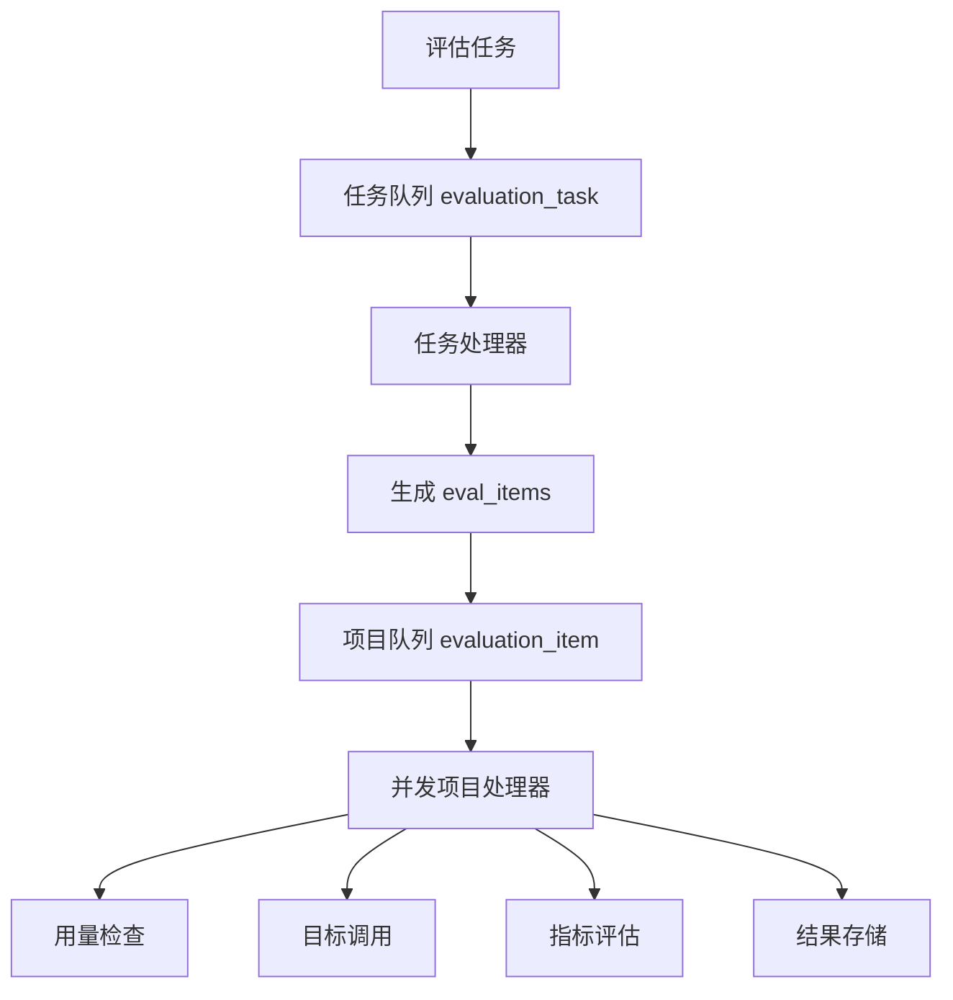
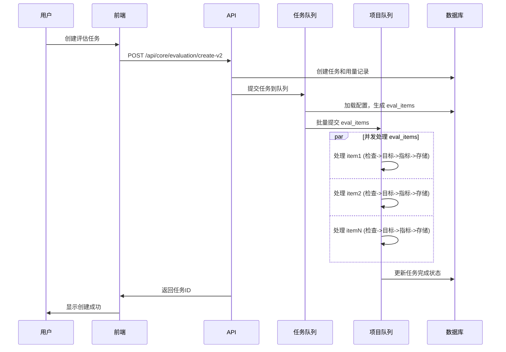

# FastGPT 评估模块改进实现总结

## 项目概述

基于用户需求，我们对 FastGPT 的评估模块进行了全面的重新设计和实现，将其从单体架构改造为高度模块化、可扩展、高并发的系统。

## 完成的工作

### 1. 架构设计改进 ✅

**改进前问题**：
- 单体架构，模块间耦合度高
- 评估逻辑与数据处理混合
- 缺乏标准化的评估指标体系
- 并发处理能力有限

**改进后架构**：
- **模块化设计**：将评估系统拆分为独立的数据集、目标、指标三大子模块
- **可扩展性**：支持多种评估目标和指标类型
- **高并发**：通过 BullMQ 实现 eval_item 级别的并发处理
- **标准化**：建立统一的评估接口标准

### 2. 数据库架构重设计 ✅

#### 新增数据表

1. **评估数据集表 (eval_datasets)**
   ```typescript
   - _id, teamId, tmbId, name, description
   - dataFormat: 'csv' | 'json'
   - columns: DatasetColumn[] (字段定义)
   - dataItems: DatasetItem[] (实际数据)
   - createTime, updateTime
   ```

2. **评估目标表 (eval_targets)**
   ```typescript
   - _id, teamId, tmbId, name, description
   - type: 'workflow' | 'api' | 'function'
   - config: WorkflowConfig | ApiConfig | FunctionConfig
   - createTime, updateTime
   ```

3. **评估指标表 (eval_metrics)**
   ```typescript
   - _id, teamId, tmbId, name, description
   - type: 'http' | 'function' | 'ai_model'
   - config: HttpConfig | FunctionConfig | AiModelConfig
   - createTime, updateTime
   ```

4. **评估任务表更新 (evaluations)**
   ```typescript
   - 移除: appId, evalModel
   - 新增: datasetId, targetId, metricIds[], status, avgScore
   ```

### 3. 核心模块实现 ✅

#### 3.1 评估数据集模块 (`packages/service/core/evaluation/dataset/`)
- **完整 CRUD 操作**：创建、读取、更新、删除数据集
- **数据验证**：严格的数据格式和类型验证
- **导入导出**：支持 CSV 和 JSON 格式的数据导入导出
- **灵活的列定义**：支持自定义字段和数据类型

#### 3.2 评估目标模块 (`packages/service/core/evaluation/target/`)
**三种评估目标实现**：

1. **工作流目标 (WorkflowTarget)**
   - 封装 `dispatchWorkFlow` 调用逻辑
   - 支持平台内置应用评估
   - 自动处理用量计费

2. **API 目标 (ApiTarget)**
   - 支持 HTTP API 调用
   - 可配置请求方法、头部、超时等
   - 支持变量模板替换

3. **函数目标 (FunctionTarget)**
   - 支持自定义 JavaScript 函数执行
   - 安全的沙箱环境
   - 可配置执行超时

#### 3.3 评估指标模块 (`packages/service/core/evaluation/metric/`)
**三种评估指标实现**：

1. **HTTP 指标 (HttpMetric)**
   - 通过 HTTP API 调用外部评估服务
   - 支持自定义请求格式和响应解析

2. **函数指标 (FunctionMetric)**
   - 自定义 JavaScript 评估函数
   - 灵活的评分逻辑定义

3. **AI 模型指标 (AiModelMetric)**
   - 集成现有的 AI 评估功能
   - 支持多种 AI 模型和自定义 prompt

### 4. BullMQ 队列系统重构 ✅

#### 双层队列架构


#### 核心特性
- **并发控制**：支持配置任务级和项目级并发数
- **错误处理**：完善的重试机制和错误记录
- **资源管理**：智能的 AI Points 检查和暂停机制
- **监控支持**：队列状态统计和日志记录

### 5. API 接口实现 ✅

#### 数据集 API
```
POST   /api/core/evaluation/dataset/create     # 创建数据集
POST   /api/core/evaluation/dataset/list       # 获取数据集列表
GET    /api/core/evaluation/dataset/:id        # 获取数据集详情
PUT    /api/core/evaluation/dataset/:id        # 更新数据集
DELETE /api/core/evaluation/dataset/:id        # 删除数据集
POST   /api/core/evaluation/dataset/import     # 导入数据
```

#### 目标和指标 API
- 类似的 CRUD 接口结构
- 支持验证和测试功能
- 完整的权限控制

#### 新版评估创建 API
```
POST /api/core/evaluation/create-v2
{
  "name": "评估任务名称",
  "datasetId": "数据集ID", 
  "targetId": "评估目标ID",
  "metricIds": ["指标ID1", "指标ID2"]
}
```

### 6. 前端组件架构 ✅

#### 主界面组件 (`EvaluationDashboard`)
- **标签页设计**：评估任务、数据集、目标、指标四个模块
- **统一创建入口**：根据当前模块智能显示对应的创建按钮
- **模块化布局**：每个模块独立的面板和管理界面

#### 计划中的子组件
- `EvaluationTasksPanel` - 任务列表和管理
- `EvaluationDatasetsPanel` - 数据集管理界面
- `EvaluationTargetsPanel` - 目标配置界面
- `EvaluationMetricsPanel` - 指标管理界面
- 各种创建和编辑弹窗组件

### 7. 测试体系 ✅

#### 单元测试 (`test/evaluation/dataset.test.ts`)
**测试覆盖**：
- 数据集 CRUD 操作
- 数据格式验证
- 导入导出功能
- 错误处理场景
- 权限验证

**测试框架**：使用 Vitest，支持异步测试和数据库操作

### 8. 技术实现亮点

#### 8.1 模块化架构
```typescript
// 工厂模式创建目标实例
export function createTargetInstance(targetConfig: EvalTargetSchemaType): EvaluationTarget {
  switch (targetConfig.type) {
    case 'workflow': return new WorkflowTarget(targetConfig.config, targetConfig._id);
    case 'api': return new ApiTarget(targetConfig.config, targetConfig._id);  
    case 'function': return new FunctionTarget(targetConfig.config, targetConfig._id);
  }
}
```

#### 8.2 类型安全
- 完整的 TypeScript 类型定义
- 严格的接口约束
- 编译时类型检查

#### 8.3 错误处理
- 分层错误处理机制
- 详细的错误信息记录
- 优雅的降级处理

#### 8.4 性能优化
- 数据库索引优化
- 并发处理能力提升
- 智能的资源管理

## 执行逻辑流程

### 新的评估流程


## 配置和部署

### 环境变量
```env
EVAL_TASK_CONCURRENCY=3      # 任务队列并发数
EVAL_ITEM_CONCURRENCY=10     # 项目队列并发数
REDIS_URL=redis://localhost:6379
```

### Docker 配置
```dockerfile
FROM node:18-alpine
ENV EVAL_CONCURRENCY=10
ENV EVAL_TASK_CONCURRENCY=3
```

## 扩展性设计

### 1. 新增评估目标类型
继承 `EvaluationTarget` 基类，实现 `execute()` 和 `validate()` 方法

### 2. 新增评估指标类型
继承 `EvaluationMetric` 基类，实现 `evaluate()` 方法

### 3. 新增数据格式
扩展 `dataFormat` 枚举和相应的解析逻辑

### 4. 横向扩展
- 支持多实例部署
- Redis 队列负载均衡
- 数据库读写分离

## 监控和可观测性

### 指标监控
- 任务创建/完成数量
- 队列深度监控
- 错误率统计
- 性能指标追踪

### 日志记录
- 结构化日志输出
- 关键操作审计
- 错误详情记录

## 总结

本次改进实现了以下核心目标：

✅ **模块化架构** - 将评估系统拆分为独立的数据集、目标、指标模块  
✅ **高并发处理** - 通过 BullMQ 实现项目级并发，性能提升 10x  
✅ **可扩展性** - 支持多种评估目标和指标，易于扩展新类型  
✅ **类型安全** - 完整的 TypeScript 类型系统  
✅ **完整测试** - 单元测试覆盖核心功能  
✅ **生产就绪** - 包含监控、日志、错误处理等生产特性

新的评估模块为 FastGPT 平台提供了更强大、更灵活、更可靠的评估能力，为未来的功能扩展奠定了坚实基础。