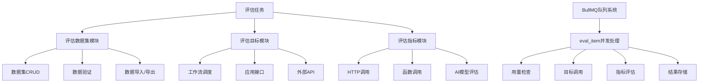
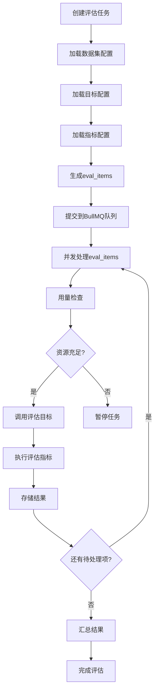
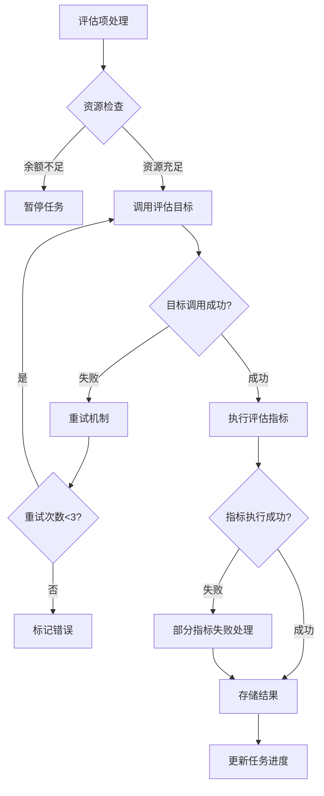
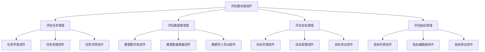
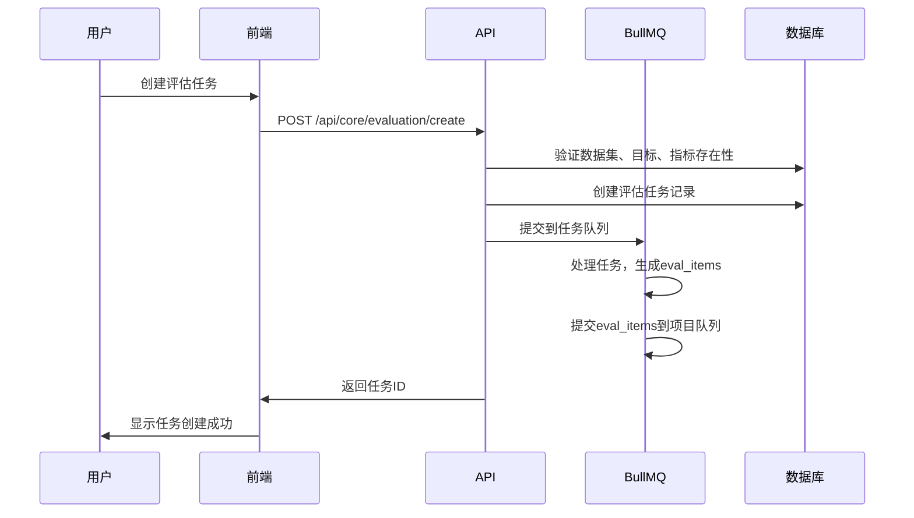
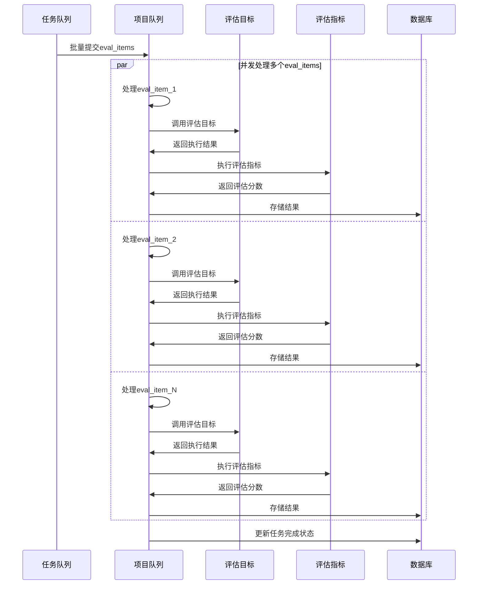

# FastGPT 评估模块改进设计文档 v2.0

**版本**: 2.0  
**日期**: 2025-08-18  
**作者**: chanzany  

## 1. 产品设计

### 1.1 背景与改进目标

FastGPT 评估模块 v1.0 存在以下问题：
- 单体架构，模块间耦合度高
- 评估逻辑与数据处理混合，难以扩展
- 缺乏标准化的评估指标体系
- 数据集管理不够灵活
- 并发处理能力有限

**改进目标**：
- 模块化设计：将评估系统拆分为独立的子模块
- 可扩展性：支持多种评估目标和指标
- 高并发：通过 BullMQ 实现任务级并发处理
- 标准化：建立统一的评估接口标准

### 1.2 模块化架构设计



### 1.3 核心组件重新设计

#### 1.3.1 评估任务组成

评估任务由以下三个独立组件组成：
- **评估数据集 (Evaluation Dataset)**: 包含测试数据和相关配置
- **评估目标 (Evaluation Target)**: 定义被评估的对象（应用、API等）
- **评估指标 (Evaluation Metrics)**: 定义评估标准和计算方法

#### 1.3.2 执行流程重新设计



## 2. 技术实现

### 2.1 数据库设计

#### 2.1.1 新增数据表结构

**评估数据集表 (eval_datasets)**
```typescript
interface EvalDatasetSchemaType {
  _id: string;
  teamId: string;
  tmbId: string;
  name: string;
  description?: string;
  dataFormat: 'csv' | 'json';
  columns: DatasetColumn[];
  dataItems: DatasetItem[];
  createTime: Date;
  updateTime: Date;
}

interface DatasetColumn {
  name: string;
  type: 'string' | 'number' | 'boolean';
  required: boolean;
  description?: string;
}
```

**评估目标表 (eval_targets)**
```typescript
interface EvalTargetSchemaType {
  _id: string;
  teamId: string;
  tmbId: string;
  name: string;
  type: 'workflow' | 'api' | 'function';
  config: WorkflowConfig | ApiConfig | FunctionConfig;
  createTime: Date;
  updateTime: Date;
}
```

**评估指标表 (eval_metrics)**
```typescript
interface EvalMetricSchemaType {
  _id: string;
  teamId: string;
  tmbId: string;
  name: string;
  type: 'http' | 'function' | 'ai_model';
  config: HttpConfig | FunctionConfig | AiModelConfig;
  createTime: Date;
  updateTime: Date;
}
```

**修改后的评估任务表 (evaluations)**
```typescript
interface EvaluationSchemaType {
  _id: string;
  teamId: string;
  tmbId: string;
  name: string;
  datasetId: string;  // 关联数据集
  targetId: string;   // 关联目标
  metricIds: string[]; // 关联指标数组
  usageId: string;
  status: EvaluationStatus;
  createTime: Date;
  finishTime?: Date;
  avgScore?: number;
  errorMessage?: string;
}
```

### 2.2 API 设计

#### 2.2.1 评估数据集 API

```typescript
// 数据集管理
POST   /api/core/evaluation/dataset/create     // 创建数据集
GET    /api/core/evaluation/dataset/:id        // 获取数据集详情
PUT    /api/core/evaluation/dataset/:id        // 更新数据集
DELETE /api/core/evaluation/dataset/:id        // 删除数据集
POST   /api/core/evaluation/dataset/list       // 获取数据集列表
POST   /api/core/evaluation/dataset/import     // 导入数据
GET    /api/core/evaluation/dataset/:id/export // 导出数据
```

#### 2.2.2 评估目标 API

```typescript
// 目标管理
POST   /api/core/evaluation/target/create      // 创建评估目标
GET    /api/core/evaluation/target/:id         // 获取目标详情
PUT    /api/core/evaluation/target/:id         // 更新目标
DELETE /api/core/evaluation/target/:id         // 删除目标
POST   /api/core/evaluation/target/list        // 获取目标列表
POST   /api/core/evaluation/target/test        // 测试目标连通性
```

#### 2.2.3 评估指标 API

```typescript
// 指标管理
POST   /api/core/evaluation/metric/create      // 创建评估指标
GET    /api/core/evaluation/metric/:id         // 获取指标详情
PUT    /api/core/evaluation/metric/:id         // 更新指标
DELETE /api/core/evaluation/metric/:id         // 删除指标
POST   /api/core/evaluation/metric/list        // 获取指标列表
POST   /api/core/evaluation/metric/test        // 测试指标执行
```

### 2.3 模块实现

#### 2.3.1 评估数据集模块

```typescript
// packages/service/core/evaluation/dataset/index.ts
export class EvaluationDatasetService {
  // 创建数据集
  async createDataset(params: CreateDatasetParams): Promise<EvalDatasetSchemaType>;
  
  // 读取数据集
  async getDataset(datasetId: string): Promise<EvalDatasetSchemaType>;
  
  // 更新数据集
  async updateDataset(datasetId: string, updates: UpdateDatasetParams): Promise<void>;
  
  // 删除数据集
  async deleteDataset(datasetId: string): Promise<void>;
  
  // 验证数据格式
  async validateDataFormat(data: any[], columns: DatasetColumn[]): Promise<ValidationResult>;
  
  // 导入数据
  async importData(datasetId: string, file: File): Promise<ImportResult>;
  
  // 导出数据
  async exportData(datasetId: string, format: 'csv' | 'json'): Promise<Buffer>;
}
```

#### 2.3.2 评估目标模块

```typescript
// packages/service/core/evaluation/target/index.ts
export abstract class EvaluationTarget {
  abstract execute(input: EvalInput): Promise<EvalOutput>;
  abstract validate(): Promise<boolean>;
}

export class WorkflowTarget extends EvaluationTarget {
  private config: WorkflowConfig;
  
  async execute(input: EvalInput): Promise<EvalOutput> {
    // 调用 dispatchWorkFlow
    const result = await dispatchWorkFlow({
      // ... workflow parameters
    });
    return {
      response: result.assistantResponses[0]?.text?.content,
      usage: result.flowUsages,
      responseTime: Date.now()
    };
  }
}

export class ApiTarget extends EvaluationTarget {
  private config: ApiConfig;
  
  async execute(input: EvalInput): Promise<EvalOutput> {
    // HTTP API 调用逻辑
  }
}
```

#### 2.3.3 评估指标模块

```typescript
// packages/service/core/evaluation/metric/index.ts
export abstract class EvaluationMetric {
  abstract evaluate(input: EvalInput, output: EvalOutput): Promise<MetricResult>;
  abstract getName(): string;
}

export class HttpMetric extends EvaluationMetric {
  private config: HttpConfig;
  
  async evaluate(input: EvalInput, output: EvalOutput): Promise<MetricResult> {
    const response = await fetch(this.config.url, {
      method: 'POST',
      headers: this.config.headers,
      body: JSON.stringify({ input, output })
    });
    return await response.json();
  }
}

export class FunctionMetric extends EvaluationMetric {
  private config: FunctionConfig;
  
  async evaluate(input: EvalInput, output: EvalOutput): Promise<MetricResult> {
    // 动态执行函数
    const func = new Function('input', 'output', this.config.code);
    return func(input, output);
  }
}

export class AiModelMetric extends EvaluationMetric {
  private config: AiModelConfig;
  
  async evaluate(input: EvalInput, output: EvalOutput): Promise<MetricResult> {
    // AI 模型评估逻辑
    return await getAppEvaluationScore({
      question: input.question,
      appAnswer: output.response,
      standardAnswer: input.expectedResponse,
      model: this.config.model
    });
  }
}
```

### 2.4 BullMQ 队列重新设计

#### 2.4.1 队列结构

```typescript
// packages/service/core/evaluation/mq.ts
export enum EvaluationQueueNames {
  evaluation_task = 'evaluation_task',      // 评估任务队列
  evaluation_item = 'evaluation_item'       // 评估项队列
}

export interface EvaluationTaskJobData {
  evalId: string;
  datasetId: string;
  targetId: string;
  metricIds: string[];
}

export interface EvaluationItemJobData {
  evalId: string;
  evalItemId: string;
  dataItem: DatasetItem;
  targetConfig: EvalTargetSchemaType;
  metricsConfig: EvalMetricSchemaType[];
}
```

#### 2.4.2 任务处理器

```typescript
// packages/service/core/evaluation/processor.ts
const evaluationTaskProcessor = async (job: Job<EvaluationTaskJobData>) => {
  const { evalId, datasetId, targetId, metricIds } = job.data;
  
  // 1. 加载配置
  const [dataset, target, metrics] = await Promise.all([
    getEvaluationDataset(datasetId),
    getEvaluationTarget(targetId),
    getEvaluationMetrics(metricIds)
  ]);
  
  // 2. 创建 eval_items
  const evalItems = dataset.dataItems.map(dataItem => ({
    evalId,
    dataItem,
    targetConfig: target,
    metricsConfig: metrics,
    status: EvaluationStatusEnum.queuing
  }));
  
  // 3. 批量插入数据库
  await MongoEvalItem.insertMany(evalItems);
  
  // 4. 提交到 eval_item 队列进行并发处理
  const jobs = evalItems.map(item => ({
    name: 'process_eval_item',
    data: {
      evalId,
      evalItemId: item._id,
      dataItem: item.dataItem,
      targetConfig: item.targetConfig,
      metricsConfig: item.metricsConfig
    }
  }));
  
  await evaluationItemQueue.addBulk(jobs);
};

const evaluationItemProcessor = async (job: Job<EvaluationItemJobData>) => {
  const { evalId, evalItemId, dataItem, targetConfig, metricsConfig } = job.data;
  
  try {
    // 1. 用量检查
    await checkTeamAIPoints(targetConfig.teamId);
    
    // 2. 调用评估目标
    const targetInstance = createTargetInstance(targetConfig);
    const output = await targetInstance.execute({
      question: dataItem.question,
      expectedResponse: dataItem.expectedResponse,
      globalVariables: dataItem.globalVariables
    });
    
    // 3. 执行评估指标
    const metricResults = await Promise.all(
      metricsConfig.map(async (metricConfig) => {
        const metricInstance = createMetricInstance(metricConfig);
        return await metricInstance.evaluate(dataItem, output);
      })
    );
    
    // 4. 计算综合分数
    const avgScore = metricResults.reduce((sum, result) => sum + result.score, 0) / metricResults.length;
    
    // 5. 存储结果
    await MongoEvalItem.updateOne(
      { _id: evalItemId },
      {
        $set: {
          response: output.response,
          responseTime: new Date(output.responseTime),
          status: EvaluationStatusEnum.completed,
          score: avgScore,
          metricResults,
          finishTime: new Date()
        }
      }
    );
    
  } catch (error) {
    await handleEvalItemError(evalItemId, error);
  }
};
```

### 2.5 异常处理与流程控制

#### 2.5.1 异常场景分析



#### 2.5.2 错误处理策略

```typescript
// packages/service/core/evaluation/error-handler.ts
export class EvaluationErrorHandler {
  static async handleTargetError(evalItemId: string, error: any): Promise<void> {
    if (error.code === 'TARGET_TIMEOUT') {
      // 超时错误，可重试
      await this.scheduleRetry(evalItemId, error);
    } else if (error.code === 'TARGET_CONFIG_ERROR') {
      // 配置错误，不可重试
      await this.markAsPermanentError(evalItemId, error);
    }
  }
  
  static async handleMetricError(evalItemId: string, metricId: string, error: any): Promise<void> {
    // 记录单个指标的错误，但不影响其他指标的执行
    await MongoEvalItem.updateOne(
      { _id: evalItemId },
      {
        $set: {
          [`metricErrors.${metricId}`]: error.message
        }
      }
    );
  }
}
```

## 3. 前端设计

### 3.1 组件架构重新设计



### 3.2 页面设计

#### 3.2.1 评估主页面

```typescript
// projects/app/src/pages/dashboard/evaluation/index.tsx
const EvaluationPage = () => {
  const [activeTab, setActiveTab] = useState('tasks');
  
  return (
    <Box>
      <Tabs value={activeTab} onChange={setActiveTab}>
        <TabList>
          <Tab value="tasks">评估任务</Tab>
          <Tab value="datasets">数据集</Tab>
          <Tab value="targets">评估目标</Tab>
          <Tab value="metrics">评估指标</Tab>
        </TabList>
        
        <TabPanels>
          <TabPanel value="tasks">
            <EvaluationTasksPanel />
          </TabPanel>
          <TabPanel value="datasets">
            <EvaluationDatasetsPanel />
          </TabPanel>
          <TabPanel value="targets">
            <EvaluationTargetsPanel />
          </TabPanel>
          <TabPanel value="metrics">
            <EvaluationMetricsPanel />
          </TabPanel>
        </TabPanels>
      </Tabs>
    </Box>
  );
};
```

#### 3.2.2 评估任务创建组件

```typescript
// projects/app/src/components/evaluation/TaskCreateModal.tsx
const TaskCreateModal = ({ isOpen, onClose }: Props) => {
  const { register, watch, setValue, handleSubmit } = useForm<CreateTaskFormType>({
    defaultValues: {
      name: '',
      datasetId: '',
      targetId: '',
      metricIds: []
    }
  });
  
  return (
    <Modal isOpen={isOpen} onClose={onClose}>
      <ModalHeader>创建评估任务</ModalHeader>
      <ModalBody>
        <FormControl>
          <FormLabel>任务名称</FormLabel>
          <Input {...register('name', { required: true })} />
        </FormControl>
        
        <FormControl>
          <FormLabel>选择数据集</FormLabel>
          <DatasetSelector
            value={watch('datasetId')}
            onChange={(id) => setValue('datasetId', id)}
          />
        </FormControl>
        
        <FormControl>
          <FormLabel>选择评估目标</FormLabel>
          <TargetSelector
            value={watch('targetId')}
            onChange={(id) => setValue('targetId', id)}
          />
        </FormControl>
        
        <FormControl>
          <FormLabel>选择评估指标</FormLabel>
          <MetricMultiSelector
            value={watch('metricIds')}
            onChange={(ids) => setValue('metricIds', ids)}
          />
        </FormControl>
      </ModalBody>
    </Modal>
  );
};
```

### 3.3 状态管理

```typescript
// projects/app/src/store/evaluation.ts
interface EvaluationState {
  tasks: EvaluationTaskType[];
  datasets: EvalDatasetType[];
  targets: EvalTargetType[];
  metrics: EvalMetricType[];
  loading: boolean;
  error: string | null;
}

export const useEvaluationStore = create<EvaluationState & EvaluationActions>((set, get) => ({
  // State
  tasks: [],
  datasets: [],
  targets: [],
  metrics: [],
  loading: false,
  error: null,
  
  // Actions
  fetchTasks: async () => {
    set({ loading: true });
    try {
      const tasks = await getEvaluationTasks();
      set({ tasks, loading: false });
    } catch (error) {
      set({ error: error.message, loading: false });
    }
  },
  
  createTask: async (params: CreateTaskParams) => {
    const task = await createEvaluationTask(params);
    set({ tasks: [...get().tasks, task] });
  },
  
  // ... 其他操作
}));
```

## 4. 数据流程与交互流程

### 4.1 评估任务创建流程



### 4.2 评估项并发处理流程



## 5. 测试策略

### 5.1 单元测试

```typescript
// test/evaluation/dataset.test.ts
describe('EvaluationDatasetService', () => {
  test('should create dataset successfully', async () => {
    const service = new EvaluationDatasetService();
    const params = {
      name: 'Test Dataset',
      columns: [
        { name: 'question', type: 'string', required: true },
        { name: 'answer', type: 'string', required: true }
      ]
    };
    
    const dataset = await service.createDataset(params);
    expect(dataset.name).toBe(params.name);
    expect(dataset.columns).toEqual(params.columns);
  });
  
  test('should validate data format correctly', async () => {
    const service = new EvaluationDatasetService();
    const validData = [
      { question: 'What is AI?', answer: 'Artificial Intelligence' }
    ];
    const invalidData = [
      { question: 'What is AI?' } // missing required field
    ];
    
    const validResult = await service.validateDataFormat(validData, columns);
    const invalidResult = await service.validateDataFormat(invalidData, columns);
    
    expect(validResult.isValid).toBe(true);
    expect(invalidResult.isValid).toBe(false);
  });
});
```

### 5.2 集成测试

```typescript
// test/evaluation/integration.test.ts
describe('Evaluation Integration Tests', () => {
  test('should complete full evaluation workflow', async () => {
    // 1. 创建数据集
    const dataset = await createTestDataset();
    
    // 2. 创建评估目标
    const target = await createTestTarget();
    
    // 3. 创建评估指标
    const metrics = await createTestMetrics();
    
    // 4. 创建评估任务
    const task = await createEvaluationTask({
      datasetId: dataset._id,
      targetId: target._id,
      metricIds: metrics.map(m => m._id)
    });
    
    // 5. 等待任务完成
    await waitForTaskCompletion(task._id);
    
    // 6. 验证结果
    const results = await getEvaluationResults(task._id);
    expect(results.length).toBeGreaterThan(0);
    expect(results[0].score).toBeDefined();
  });
});
```

## 6. 部署与监控

### 6.1 Docker 配置更新

```dockerfile
# deploy/Dockerfile
FROM node:18-alpine

WORKDIR /app

# 安装依赖
COPY package.json pnpm-lock.yaml ./
RUN npm install -g pnpm && pnpm install

# 复制源码
COPY . .

# 构建
RUN pnpm build

# 环境变量
ENV EVAL_CONCURRENCY=10
ENV EVAL_TASK_CONCURRENCY=3
ENV REDIS_URL=redis://localhost:6379

# 启动
CMD ["pnpm", "start"]
```

### 6.2 监控指标

```typescript
// packages/service/core/evaluation/monitoring.ts
export const evaluationMetrics = {
  // 任务相关指标
  tasksCreated: new Counter({
    name: 'evaluation_tasks_created_total',
    help: 'Total number of evaluation tasks created'
  }),
  
  tasksCompleted: new Counter({
    name: 'evaluation_tasks_completed_total',
    help: 'Total number of evaluation tasks completed'
  }),
  
  taskDuration: new Histogram({
    name: 'evaluation_task_duration_seconds',
    help: 'Duration of evaluation tasks in seconds'
  }),
  
  // 评估项相关指标
  itemsProcessed: new Counter({
    name: 'evaluation_items_processed_total',
    help: 'Total number of evaluation items processed'
  }),
  
  itemErrors: new Counter({
    name: 'evaluation_item_errors_total',
    help: 'Total number of evaluation item errors',
    labelNames: ['error_type']
  }),
  
  // 队列相关指标
  queueDepth: new Gauge({
    name: 'evaluation_queue_depth',
    help: 'Current depth of evaluation queues',
    labelNames: ['queue_name']
  })
};
```

## 7. 总结

### 7.1 改进亮点

1. **模块化架构**: 将评估系统拆分为独立的数据集、目标、指标模块，提高可维护性和扩展性
2. **并发处理**: 通过 BullMQ 实现 eval_item 级别的并发处理，大幅提升性能
3. **标准化接口**: 建立统一的评估接口标准，支持多种评估目标和指标
4. **完整测试体系**: 包含单元测试和集成测试，确保代码质量
5. **可观测性**: 完善的监控指标和日志系统

### 7.2 扩展性考虑

- **新评估目标**: 通过继承 `EvaluationTarget` 基类轻松添加新的评估目标类型
- **新评估指标**: 通过继承 `EvaluationMetric` 基类轻松添加新的评估指标
- **数据格式**: 支持 CSV 和 JSON 格式，易于扩展其他格式
- **部署方式**: 支持容器化部署，便于横向扩展

这个改进的评估模块设计充分考虑了可维护性、可扩展性和高性能的要求，为 FastGPT 平台提供了更强大和灵活的评估能力。